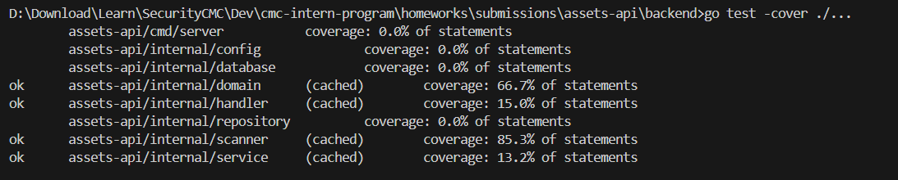
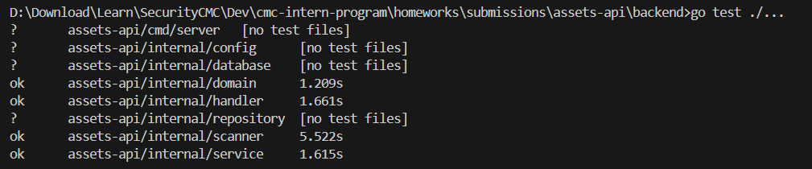

# Homework Submission - Day 3

**Họ tên:** Nguyễn Thị Huyền

## Các bài đã hoàn thành

- [x] Bài 1: Mở rộng Scan API
- [x] Bài 2: Viết Unit Tests
- [x] Bài 3: Tích hợp Frontend
- [x] Bài 4: CI/CD với GitHub Actions
- [x] Bài 5: Deploy với Docker Compose
- [ ] Bài 6: Tính năng EASM mới (Bonus)
- [ ] Bài 7: Deploy lên Cloud VM (Bonus)
- [ ] Bài 8: Domain & TLS/HTTPS (Bonus)
- [ ] Bài 9: Auto Deploy on Merge (Bonus)

## Link Repository

[Điền link GitHub repository]

## Link Demo (nếu có)

[Điền link deployed application]

## Bằng chứng kiểm thử

- API scan: đính kèm screenshot hoặc command output cho các endpoint scan.

### Unit tests:

`go test -cover ./tests/...`.

- CI: đính kèm screenshot jobs xanh ở tab Actions.
